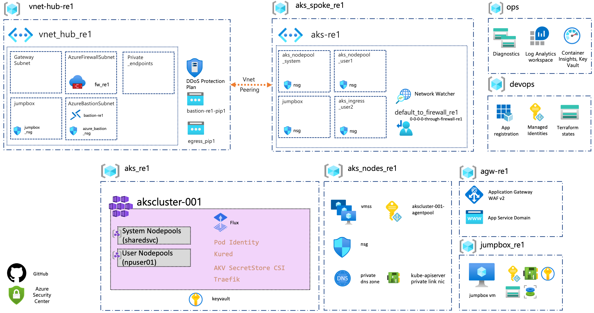

# Deployment of Enterprise-Scale AKS Construction Set

This reference implementation of AKS Secure Baseline Architecture within Enterprise Scale environment is built on CAF Terraform Landing zone framework composition.

The following components will be deployed by the Enterprise-Scale AKS Construction Set. You can review each component as described below:



| Components                                                                                              | Config files                                                 | Description|
|-----------------------------------------------------------|------------------------------------------------------------|------------------------------------------------------------|
| Global Settings |[global_settings.tfvars](configuration/global_settings.tfvars) | Primary Region setting. Changing this will redeploy the whole stack to another Region|
| Resource Groups | [resource_groups.tfvars](./configuration/resource_groups.tfvars)| Resource groups configs |
| Azure Kubernetes Service | [aks.tfvars](./configuration/aks.tfvars) | AKS addons, version, nodepool configs |
||<p align="center">**Identity & Access Management**</p>||
| Identity & Access Management | [iam_aad.tfvars](./configuration/iam/iam_aad.tfvars) <br /> [iam_managed_identities.tfvars](./configuration/iam/iam_managed_identities.tfvars) <br /> [iam_role_mappings.tfvars](./configuration/iam/iam_role_mappings.tfvars)| AAD admin group, User Managed Identities & Role Assignments |
||<p align="center">**Gateway**</p>||
| Application Gateway | [agw.tfvars](./configuration/agw/agw.tfvars) <br /> [agw_application.tfvars](./configuration/agw/agw_application.tfvars) <br />| Application Gateway WAF v2 Configs with aspnetapp workload settings |
| App Service Domains | [domain.tfvars](./configuration/agw/domain.tfvars) | Public domain to be used in Application Gateway |
||<p align="center">**Networking**</p>||
| Virtual networks | [networking.tfvars](./configuration/networking/networking.tfvars) <br /> [peerings.tfvars](./configuration/networking/peerings.tfvars) <br /> [nsg.tfvars](./configuration/networking/nsg.tfvars) <br /> [ip_groups.tfvars](./configuration/networking/ip_groups.tfvars)| CIDRs, Subnets, NSGs & peerings config for Azure Firewall Hub & AKS Spoke |
| Private DNS Zone | [private_dns.tfvars](./configuration/networking/private_dns.tfvars) | Private DNS zone for AKS ingress; A record to Load Balancer IP |
| Azure Firewall  | [firewalls.tfvars](./configuration/networking/firewalls.tfvars) <br /> [firewall_application_rule_collection_definition.tfvars](./configuration/networking/firewall_application_rule_collection_definition.tfvars) <br /> [firewall_network_rule_collection_definition.tfvars](./configuration/networking/firewall_network_rule_collection_definition.tfvars) <br /> [route_tables.tfvars](./configuration/networking/route_tables.tfvars)  | Azure Firewall for restricting AKS egress traffic|
| Public IPs | [public_ips.tfvars](./configuration/networking/public_ips.tfvars) | Public IPs for Application Gateway, Azure Firewall & Azure Bastion Host |
||<p align="center">**Security & Monitoring**</p>||
| Azure Key Vault| [keyvaults.tfvars](./configuration/keyvault/keyvaults.tfvars) <br /> [certificate_requests.tfvars](./configuration/keyvault/certificate_requests.tfvars) | Key Vault to store Self signed certificate for AKS ingress & Bastion SSH key |
| Azure Monitor | [diagnostics.tfvars](./configuration/monitor/diagnostics.tfvars)  <br /> [log_analytics.tfvars](./configuration/monitor/log_analytics.tfvars) | Diagnostics settings, Log Analytics Workspace for AKS logs & Prometheus metrics |
||<p align="center">**Bastion**</p>||
| Azure Bastion (OPTIONAL) | [bastion.tfvars](./configuration/bastion/bastion.ignore) | Azure Bastion Host & Windows VM to view aspnetsample website internally. |

<br />

## Deployment

### Global variables for environment

Configure the global settings for the environment. Make sure to pick an appropriate name for the environment to minimize the risk of resource collisions. For personal environments, set `ENVIRONMENT_NAME` to something that is unique to you. For other environments like dev, or preprod, set it to a unique name for that environment. See [environment naming docs](./environment_naming.md) for more information.

```bash
# Export the base directory of the repo
cd caf-terraform-landingzones-starter
export REPO_ROOT=$(pwd)

# Navigate to aks directory
cd $REPO_ROOT/enterprise_scale/construction_sets/aks

# Name for the environment
# examples:
#   ENVIRONMENT_NAME=pnp-dev
#   ENVIRONMENT_NAME=mon-dev
#   ENVIRONMENT_NAME=integration-dev
#   ENVIRONMENT_NAME=my-unique-env
ENVIRONMENT_NAME=<environment name>
# Region for the environment
# examples:
#   LOCATION=centralus
#   LOCATION=eastus2
LOCATION=<azure region>

# Update terraform global settings file.

cat <<EOF > online/aks_secure_baseline/configuration/global_settings.tfvars
global_settings = {
  passthrough    = false
  random_length  = 0
  prefix         = "$ENVIRONMENT_NAME"
  default_region = "region1"
  regions        = {
    region1 = "$LOCATION"
  }
}
EOF

```

### Terraform setup & environment deployment

Deployment is done using the provision environment script. See the script's [README](../../provision_environment/README.md) for usage details.

```bash

# Script to execute from bash shell

# Log into Azure
az login

# show your Azure accounts
az account list -o table

# select an Azure account
az account set -s {subscription name or id}

# If you are running in Azure Cloud Shell, you need to run the following additional command:
export TF_VAR_logged_user_objectId=$(az ad signed-in-user show --query objectId -o tsv)

# Navigate to provision_environment directory
cd $REPO_ROOT/enterprise_scale/construction_sets/aks/provision_environment

# Sample: ./provision-environment.sh -a <alias>sp -t cse -f
# Including your alias in <app name> can help reduce environment collisions.
# App name must be between 5 and 18 characters in length with no special characters.
# Tenant name must be between 1 and 5 characters in length with no special characters.
# -f will create new ResourceGroup, ServicePrincipal and StorageAccount for the application and Terraform state management. Eliminate -f for subsequent runs while reusing these resources.
app_name=<app name>
tenant_name=<your tenant name>
./provision-environment.sh -a $app_name -t $tenant_name -f
```

### Cluster admin AAD group creation and assignment

TODO: The following commands have been altered so the user creates the AKS cluster admin AAD group and the automation of this should be resolved by a future spike [669](https://github.com/retaildevcrews/ngsa/issues/669).

```bash
# After Terraform deployment succeeds, assign the newly created AAD (Azure Active Directory) group as the AKS
# Workaround to have the current user create the AAD group since it is not yet automated in terraform

# Navigate out to aks directory
cd $REPO_ROOT/enterprise_scale/construction_sets/aks

# fetch current user id
current_username=$(az account show --query "user.name" -o tsv)
current_userid=$(az ad user show --id "$current_username" --query "objectId" -o tsv)

# example: cluster_admin_group_name=pnp-dev-cluster-admins
export cluster_admin_group_name=<name of cluster admin aad group>

# example: cluster_admin_group_description="AKS cluster admins for the pnp-dev environment"
export cluster_admin_group_description="<describe group>"

# create a group and save the group id
export aadGroupObjectId=$(az ad group create --display-name $cluster_admin_group_name --mail-nickname $cluster_admin_group_name --description "$cluster_admin_group_description" --query objectId -o tsv)

# add the current user to the newly created group
az ad group member add -g $cluster_admin_group_name --member-id $current_userid

# (Azure Kubernetes Service) cluster admin
# export aadGroupObjectId=$(terraform output -json | jq -r .azuread_group.value.aks_cluster_re1_admins.id)
export aksClusterName=$(terraform output -json | jq -r .aks_clusters.value.cluster_re1.cluster_name)
export aksClusterResourceGroupName=$(terraform output -json | jq -r .aks_clusters.value.cluster_re1.resource_group_name)
az aks update -g $aksClusterResourceGroupName -n $aksClusterName --aad-admin-group-object-ids $aadGroupObjectId
```

You are done with deployment of AKS environment, next step is to deploy the application and reference components.

## Next step

:arrow_forward: [Deploy sample workload into AKS](./02-aks.md)
