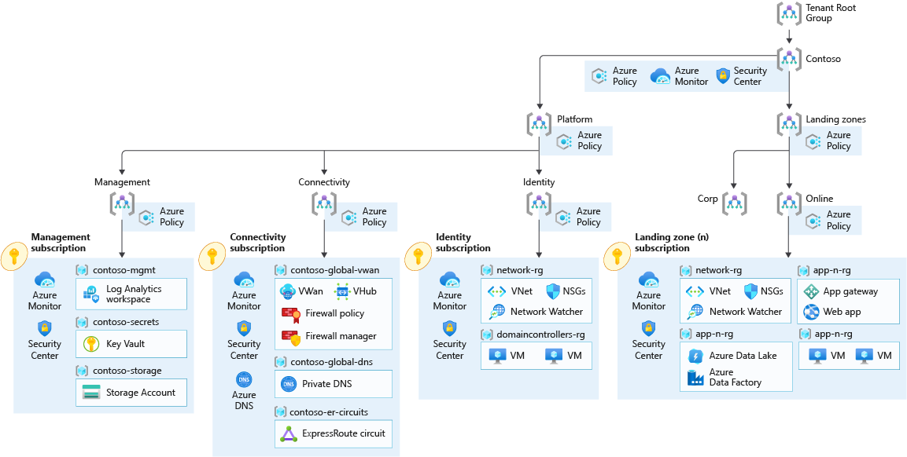

# Enterprise-Scale Construction Set for Azure Kubernetes Services using Terraform

Enterprise-scale is an architectural approach and a reference implementation that enables effective construction and operationalization of landing zones on Azure, at scale. This approach aligns with the Azure roadmap and the Cloud Adoption Framework for Azure.

The Azure Kubernetes Services Construction Set is an implementation of [AKS Secure Baseline Architecture](https://github.com/mspnp/aks-secure-baseline) for Enterprise-Scale Online Landing zone. An application deployed in a subscription for an online landing zone will be internet-facing, and does not require hybrid connectivity.

This implementation is based on [Cloud Adoption Framework Landing Zones for Terraform best practices](https://github.com/Azure/caf-terraform-landingzones).



## Applied Azure Policies for Online Landing zones

The list below details only notable Policies for this implementation, it is not exhaustive.  
Please view Azure Policy portal or [List all assigned Azure Policies](#list-all-assigned-azure-policies) section to list out the details of assigned policies

| Policy                          | Config files                                                                                                                                                                                                                                                                                                                     |
|---------------------------------|----------------------------------------------------------------------------------------------------------------------------------------------------------------------------------------------------------------------------------------------------------------------------------------------------------------------------------|
| Deploy-AKS-Policy               | Deploy Azure Policy Add-on to Azure Kubernetes Service clusters                                                                                                                                                                                                                                                                  |
| Deny-Privileged-AKS             | Do not allow privileged containers in Kubernetes cluster. <br /> Excluded namespaces: kube-system; gatekeeper-system; azure-arc; **cluster-baseline-settings** <br /> <br />  **cluster-baseline-settings** namespace is dedicated to host Daemonsets components such as AKV Secret Store CSI driver, AAD Pod Identity, Kured... |
| Deny-Privileged-Escalations-AKS | Kubernetes clusters should not allow container privilege escalation <br /> Excluded namespaces: kube-system; gatekeeper-system; azure-arc; **cluster-baseline-settings**                                                                                                                                                         |
| Enforce-Https-Ingress-AKS       | Enforce HTTPS ingress in Kubernetes cluster                                                                                                                                                                                                                                                                                      |
| **Disable** Deny-Subnet-Without-Nsg            | This must be done for successful deployment of AKS Construction Set. <br /> Specifically, Azure SDK for Go and Terraform at the moment are not able to attach an NSG at Subnet creation time                                                                                                                                                                                                                                                                          |

<br />

### List all assigned Azure Policies

```Bash
# To view details of assigned Policies of the current Subscription
az policy assignment list --disable-scope-strict-match

# To view details of assigned Policies of the a resource
az policy assignment list --disable-scope-strict-match --scope {RESOURCEID} 
```

## Common troubleshooting tips

1. Key Vault is not fully deleted

When creating a new Key Vault, soft-delete is on by default and any deleted Key Vaults are retained for 90 days by default. If you reuse the same prefix, you might see the error message saying the Key Vault with the same name already exists. To resolve it, search for Key Vault resources in the Azure portal, click "Manage deleted vaults" on the top horizontal menu bar, search for the subscription, and manually delete the vault.

2. Azure CLI (Command Line Interface) is outdated

`az aks update` command requries a certain version of Azure CLI to execute. Run `az --version` to find your Azure CLI version. If your installed version is outdated, the command will fail and prompt you to upgrade it by running `az upgrade`, which will fail if your current version is not 2.11 or higher. In that case, you will need to find alternative commands. For Mac, use `brew update && brew install azure-cli`.

## Customizations

Some updates to the existing CAF (Cloud Adoption Framework) [repo](https://github.com/Azure/caf-terraform-landingzones-starter) that we made to meet the requiremnts for NGSA are:

1. Change the deployment region to minimize latency

The region was updated to `eastus2` to have the resources deployed in the U.S. region for better latency, instead of the Asia region, where the repo was originally developed in.

Specifically, the `region1` variable in `..\enterprise_scale\construction_sets\aks\online\aks_secure_baseline\configuration\global_settings.tfvars` file was changed to `eastus2` and you can provide additional optional regions there.

2. Follow NGSA's naming convention

Updated the resource names to follow the project naming convention to be consistent across different feature crews. One example is the resource group names in `enterprise_scale\construction_sets\aks\online\aks_secure_baseline\configuration\resource_groups.tfvars` file.

3. Allow more predictable and customized resource name prefix

The initial project by default prefix the resource names with a randomly generated 4-letter strings to avoid name collisions when the script is executed repeatedly. We disabled the random prefix by default, and allow users to define their own meaningful prefix including information of deployment environment, region, feature and user name. See `random_length` and `prefix` attributes in  `..\enterprise_scale\construction_sets\aks\online\aks_secure_baseline\configuration\global_settings.tfvars` file.

4. Execute all the command via one shell script

All the commands were included in the `enterprise_scale\construction_sets\aks\provision_environment\provision-environment.sh` script for easy execution.

## Suggestions for future improvement

1. Craate AAD group via Terraform

Currently the required AAD group is created via Azure CLI, not as part of the Terraform module, due to the Service Principal not having sufficient permission to create AAD groups in the subscription. Keeping all Azure resource provisioning in Terraform will make it easier to keep track of their states in a central location (Terraform remote state file), and update and delete them as needed. We can extend the permissions in the Service Principal to allow the Terraform 

2. Abstract more variables to allow more customization

Identify the attributes in the resources that are more commonly customized, i.e., region, name, numbers, into additional Terraform variable files to allow users to define and manage the values in a central location. Can possibly extend and repurpose the existing `resource_group.tfvars` file to keep all the variables in one place, depending on the number and types of variables.

3. Improve troubleshooting experience for the script

The commands in the provisioning script run in a sequential order and have dependency on each other. The output of one command is provided as an input to the next command, e.g.: create a Service Principal before running the Terraform read the cluster name from the Terraform remote state before adding an AAD group to it. Currently the commands are listed as is and the error messages are not always consistent and useful. We can add custom check (if-else conditons for examples) to explicitly call out the dependency and the missing values.

# Links
[CAF Terraform provider](https://registry.terraform.io/modules/aztfmod/caf/azurerm/latest)

## Prerequisites

### Supported run environment

In order to deploy the AKS Construction set, you can use the following options:

- [Windows Subsystem for Linux](https://docs.microsoft.com/windows/wsl/about#what-is-wsl-2)
- [Azure Cloud Shell](https://shell.azure.com)
- Linux Bash Shell
- MacOS Shell
- GitHub CodeSpace

### Configuration steps

If you opt-in to setup a shell on your machine, there are required access and tooling you'll need in order to accomplish this. Follow the instructions below and on the subsequent pages so that you can get your environment ready to proceed with the AKS cluster creation.

1. An Azure subscription. If you don't have an Azure subscription, you can create a [free account](https://azure.microsoft.com/free).

   > :warning: The user or service principal initiating the deployment process _must_ have the following minimal set of Azure Role-Based Access Control (RBAC) roles:
   >
   > * [Contributor role](https://docs.microsoft.com/azure/role-based-access-control/built-in-roles#contributor) is _required_ at the subscription level to have the ability to create resource groups and perform deployments.
   > * [User Access Administrator role](https://docs.microsoft.com/azure/role-based-access-control/built-in-roles#user-access-administrator) is _required_ at the subscription level since you'll be granting least-privilege RBAC access to managed identities.
   >   * One such example is detailed in the [Container Insights documentation](https://docs.microsoft.com/azure/azure-monitor/insights/container-insights-troubleshoot#authorization-error-during-onboarding-or-update-operation).

2. An Azure AD tenant to associate your Kubernetes RBAC configuration to.

   > :warning: The user or service principal initiating the deployment process _must_ have the following minimal set of Azure AD permissions assigned:
   >
   > * Azure AD [User Administrator](https://docs.microsoft.com/azure/active-directory/users-groups-roles/directory-assign-admin-roles#user-administrator-permissions) is _required_ to create a "break glass" AKS admin Active Directory Security Group and User. Alternatively, you could get your Azure AD admin to create this for you when instructed to do so.
   >   * If you are not part of the User Administrator group in the tenant associated to your Azure subscription, please consider [creating a new tenant](https://docs.microsoft.com/azure/active-directory/fundamentals/active-directory-access-create-new-tenant#create-a-new-tenant-for-your-organization) to use while evaluating this implementation.

3. If you opt for Azure Cloud Shell, you don't need to complete those steps and can jump on the next section (step 4).  On Windows, you can use the Ubuntu on [Windows Subsystem for Linux](https://docs.microsoft.com/windows/wsl/about#what-is-wsl-2) to run Bash. Once your bash shell is up you will need to install these prerequisites.

   Latest [Azure CLI installed](https://docs.microsoft.com/cli/azure/install-azure-cli?view=azure-cli-latest)

   ```bash
   sudo apt install azure-cli
   ```

   Terrafrom (Ubuntu) : For more information visit [here](https://learn.hashicorp.com/tutorials/terraform/install-cli)

   ```bash
   curl -fsSL https://apt.releases.hashicorp.com/gpg | sudo apt-key add -
   sudo apt-add-repository "deb [arch=amd64] https://apt.releases.hashicorp.com $(lsb_release -cs) main"
   sudo apt-get update && sudo apt-get install terraform
   ```

   jq : For more information visit [here](https://stedolan.github.io/jq/download/)

   ```bash
   sudo apt install jq
   ```

   kubectl: For more information visit [here](https://kubernetes.io/docs/tasks/tools/install-kubectl/) 

   ```bash
   # kubectl: 
   curl -LO "https://dl.k8s.io/release/$(curl -L -s https://dl.k8s.io/release/stable.txt)/bin/linux/amd64/kubectl"
   sudo install -o root -g root -m 0755 kubectl /usr/local/bin/kubectl
   ```

4. Clone/download this repo locally, or even better fork this repository.

   > :twisted_rightwards_arrows: If you have forked this reference implementation repo, you'll be able to customize some of the files and commands for a more personalized experience; also ensure references to repos mentioned are updated to use your own (e.g. the following `GITHUB_REPO`).

   ```bash
   export GITHUB_REPO=https://github.com/Azure/caf-terraform-landingzones-starter.git
   git clone $GITHUB_REPO
   ```


# Next step

:arrow_forward: [Deploy infrastructures using Terraform](./01-terraform.md)
